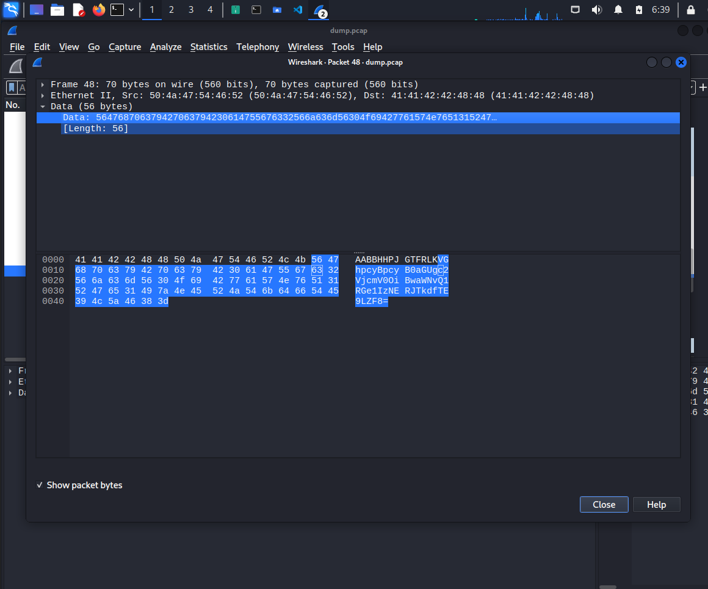

# FindAndOpen

Source: PicoCTF
Tools: Wireshark
Fields: forensic

- Download file pcap and file zip
- open file pcap with wireshark
    - there is a suspicious packet payload contains data with content can be decoded
    
    
    
    - after decode we have`picoCTF{R34DING_LOKd_` and this is also the password of the the locked file
    
    