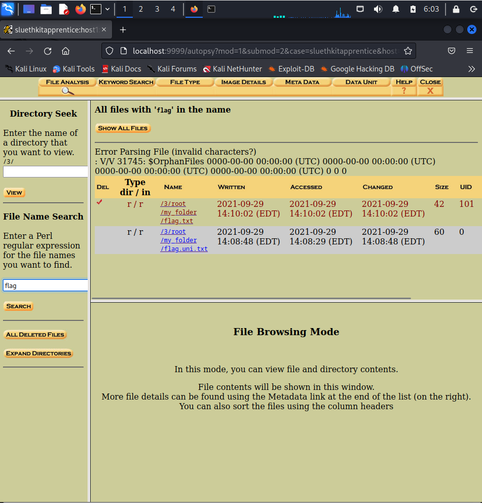

# Sleuthkit Apprentice

Source: PicoCTF
Tools: autospy
Technique: extract file
Fields: forensic

- Download file and extract the image
- Run `autopsy` and open `localhost:9999/autopsy`
    - Create a new case
    - analyze —> file analysis —> search keyword
    
    ‘’ flag ‘’ từng image đến image cuối cùng thì tìm đc 2 file 
    
    
    
    - check 2 file và tìm đc flag
    
    