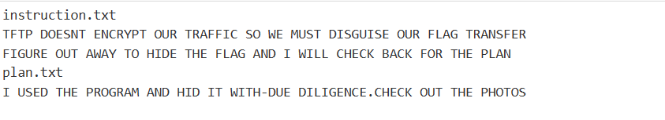

# Trivial Flag Transfer Protocol

Source: PicoCTF
Tools: Steghide, Wireshark
Technique: Export Objects, extract file
Fields: forensic

- Viewing this packet capture in Wireshark shows a substantial amount of tftp traffic:

- Extracting files transferred with tftp: File -> Export Objects -> TFTP → Save all
- After encode 2 file txt

- Dùng steghide để tìm file ẩn trong 3 ảnh giải nén đc

