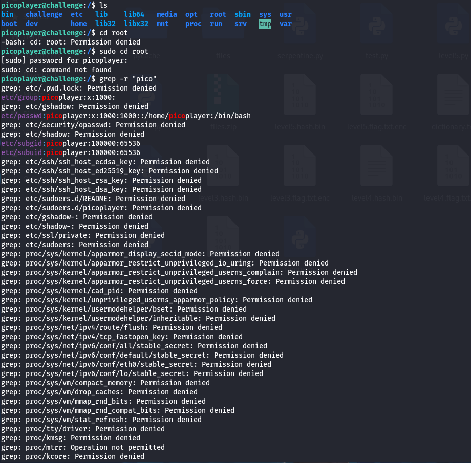

# Permissions

Source: PicoCTF
Technique: Linux Privilege Escalation
Fields: general skills, pwn
Level: easy

- https://play.picoctf.org/practice/challenge/363?category=5&page=4
- We try to check whether can we open any dir

- As we can see,, we do not have permissions to access alot of dir
- So let’s check our permission detaily

- We find out that we have root access to the vi/vim text editor. We can use the Vim privilege escalation technique to get root access and access the flag file in the root directory.
- Open vim as sudo: sudo vi
- Now that we are running Vim as root, and we can run command mode inside Vim by using :!sh and then pressing enter.

