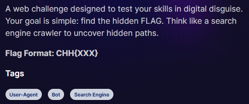

# Are you a search engine bot

Source: Cookie Arena
Tools: Burpsuite
Fields: Web

- Theo như mô tả của đề cũng như tên đề bài thì có vẻ ta cần sửa header User-Agent thành một search engine bot nào đó hợp lệ, maybe response trả về sẽ cóa j đó

- Well, sau khi test thử con Googlebot/2.1 thì …. flag ra luôn :v

