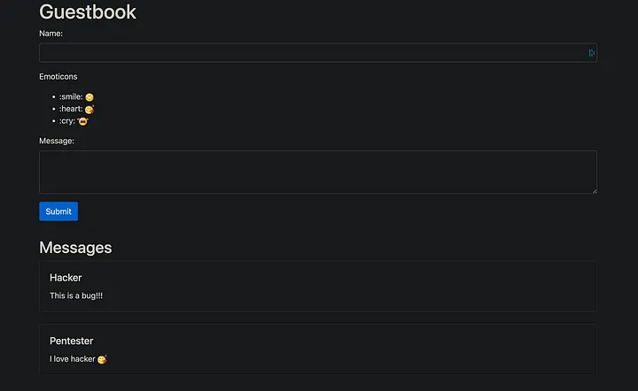

# Baby Guestbook

Source: Cookie Arena
Tools: Burpsuite
Technique: Path Traversal
Fields: Web



Ở đây có 2 form để nhập nhưng chỉ có form bên dưới là “Message" mới cho phép dùng emoji.

- emoji.go
    
    ```go
    const EMOJI_ROOT string = "static/emojis/%s"
    //--------------------------
    func getEmojiByName(name string) string {
    	emoji_name := strings.Trim(name, ":")
    	emoji_path := fmt.Sprintf(EMOJI_ROOT, emoji_name)
    
    	// read the emoji file
    	buffer, err := os.ReadFile(emoji_path)
    	if err != nil {
    		return name
    	}
    	body := base64.StdEncoding.EncodeToString(buffer)
    	data_uri := fmt.Sprintf("data:image/png; base64,%s", body)
    
    	return fmt.Sprintf(``, data_uri, emoji_name)
    }
    //-------------------------
    func ResolveEmojis(body string) string {
    	emoji_re := regexp.MustCompile(`:[^:]+:`)
    	return emoji_re.ReplaceAllStringFunc(body, getEmojiByName)
    }
    ```
    

Hàm `getEmojiByName` nhận vào một chuỗi tên emoji (`name`), loại bỏ dấu `:` xung quanh nó, và sau đó đọc tệp emoji từ thư mục `static/emojis` dựa trên tên này.

> Ví dụ: Name là :cry: thì nó sẽ đọc tệp emoji từ thư mục static/emojis/cry
> 

Vậy thì thử payload này để xem nó có đọc file `/etc/passwd` giống như đọc thư mục `static/emojis/cry` để hiển thị ra emoji không nhé.

```php
:../../../../../etc/passwd:
```

kết quả sẽ như thế này:


Dữ liệu trong file `/etc/passwd` được encode Base64 nên bạn F12 (Inspect) vào cái ảnh rồi decode nó ra nhé. Link decode mình để bên dưới.


Từ đây ta có thể thử payload khác:

```php
:../../../../../../../../../flag.txt:
```

sau đó decode base64 String 


***VẤN ĐỀ: người mới tiếp cận bài này có thể nghĩ ra được payload đúng rồi nhưng lại ko thấy kết quả là do chưa biết hoặc chưa nhận ra ta có thể F12 cái ảnh để xem chuỗi base64 đã được encode từ nội dung trả về của chuỗi nhập vào(giữa 2 dấu : :).