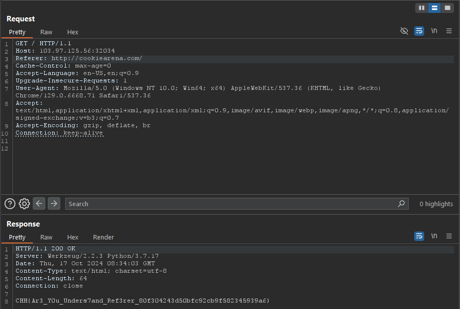

# Where do you come from

Source: Cookie Arena
Tools: Burpsuite, Curl
Technique: OS Command Injection
Fields: Web

- Describe challenge: A web challenge designed to test your basic internet skills. If you come from Cookiearena sites, the server will tell you the FLAG

—> the red phrase refer to the server will check the header Reference

- SOOO, we just add header Reference: with value: [http://cookiearena.com](http://cookiearena.com) and send it.
- BUMPPP!! We got flag!



- Instead of using burpsuite we can use curl

```php
curl -H "Referer: http://cookiearena.com/" http://103.97.125.56:30600/
```

