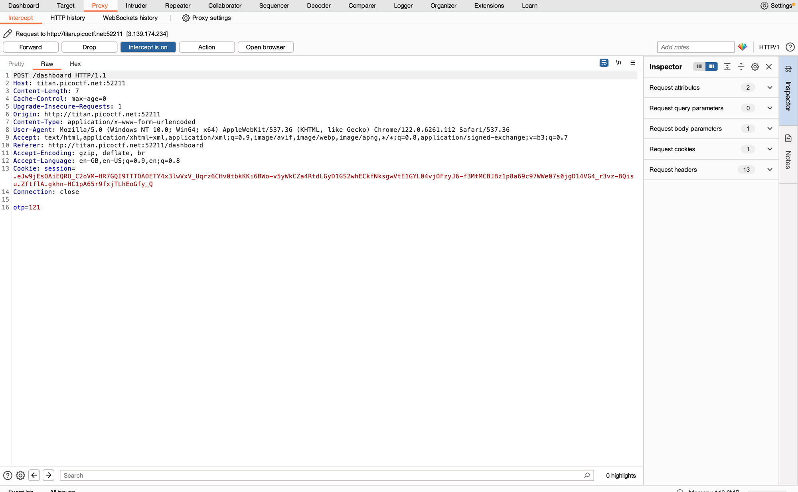

# IntroToBurp

Source: PicoCTF
Tools: Burpsuite
Fields: Web

when you intercept the request for the authentication you see something like this:

try to remove the otp parameter but the page won’t work so i thought what i change the otp parameter by var, and i got this

