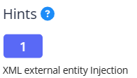

# SOAP

Source: PicoCTF

Tools: Burpsuite

Technique: XXE vul

Fields: Web

- Sử dụng proxy burpsuite để bắt package

- Khi click vào button Details ta bắt đc một package có body là một đoạn mã xml cơ bản dễ dàng exploit bằng cách thay đổi đoạn mã xml

- Sau khi gửi đến repeater để send request, ta nhận được response sau

