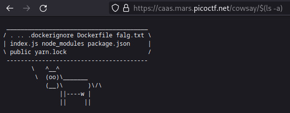

# caas

Source: PicoCTF
Fields: Web

- Read index.js: ta thấy rằng bất cứ nội dung j ở cuối URL …/cowsay/…. sẽ đưa thẳng nội dung vào file thực thi nên ta sẽ chèn lệnh vào để

```java
app.get('/cowsay/:message', (req, res) => {
  exec(`/usr/games/cowsay ${req.params.message}`, {timeout: ...}, (error, stdout) => {
    ...
  });
});
```



