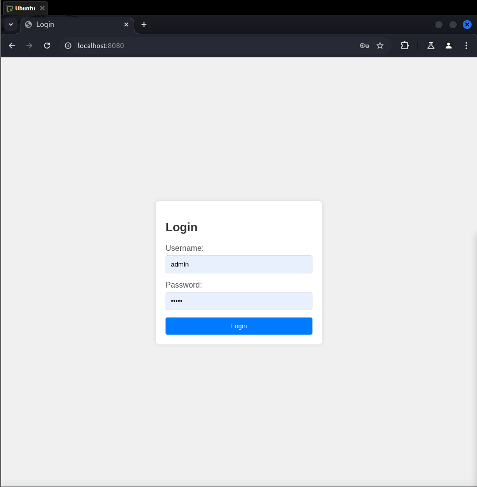

# Hacksudo Docker CTFv1 Web to root

Source: github

Tools: Burpsuite

Technique: Linux Privilege Escalation, Path Traversal, Poisoning web log

Fields: Web

[GitHub - hacksudo/hacksudoctfv1: Hacksudo Docker CTFv1 Web to root easy challange @coded By Vishal Waghmare](https://github.com/hacksudo/hacksudoctfv1/?fbclid=IwY2xjawGHYbJleHRuA2FlbQIxMQABHUP-4mpg5kqv3JeWVRhAPOTLqQkRI_OIg5LFbKVQsWCKYPV_QBftfz2rBw_aem_kRqBoLNuKPGGE5jM5wD_cw)

challenge

## GOAL

- Read file /root/root.txt

## Hint

- OWASP Top 10
- Privilege Escalation

## EXPLOIT

- Follow the instruction in Readme.md to access web



- Use username: admin - password: admin to login


- try to access three page


- hmm, regconize immediately that there is a GET parameter in url. Let’s read source code to see what happen when page.php received GET parameter
- this piece of code will lead to LFI vulnerability, allow us to read any file in system

```php
<?php
   $file = $_GET['file'];
   if(isset($file))
   {
       include("$file");
   }
   else
   {
       include("index.php");
   }
   ?>
```

- Let’s try to read /etc/passwd to check whether it work


- It’s really work, so now try to read /root/root.txt and nothing happen
- hmm hint said that we have to do sth to be able to RCE, then we have more options to explore.
- To RCE from LFI, [Log Poisoning](https://medium.com/@YNS21/utilizing-log-poisoning-elevating-from-lfi-to-rce-5dca90d0a2ac#:~:text=Log%20Poisoning%20is%20a%20technique%20used%20in%20cybersecurity,File%20Inclusion%20%28LFI%29%20to%20Remote%20Code%20Execution%20%28RCE%29.) is the first method that comes to my mind. Let’s do it


send a request with header User-Agent contains php code


it worked


check


fail

```php
#Set Apache2 server Permission
RUN chmod -R 755 /var/www/html
RUN chown -R www-data:www-data /var/www/html/
```


check who am i now


check permission of all dir at root 

—> we don’t have permission to access root and we also don’t have root role 

—> Think about another way —> how to access root and read root.txt without permission 

- Now think about second hint [**Privilege Escalation](https://medium.com/schkn/linux-privilege-escalation-using-text-editors-and-files-part-1-a8373396708d)**
- hmmm how about technique “**Using .sh file for privilege escalation”. Let’s try**
- Idea:  Note: i’ll execute multiple commands at the same time with the second one is to check whether the first command successfull(because the second command execute ifonly the first one execute successful)
    - First, create a test.sh file in /var/www/html(where we are now)
        
        ```php
        #!/bin/bash
        cat ../../../../root/root.txt
        ```
        
        
        
    - Second, Set Execution permission for test.sh
        
        
        
    - Finally, execute test.sh

AND, we done
